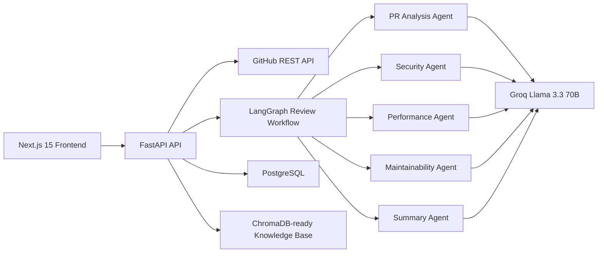
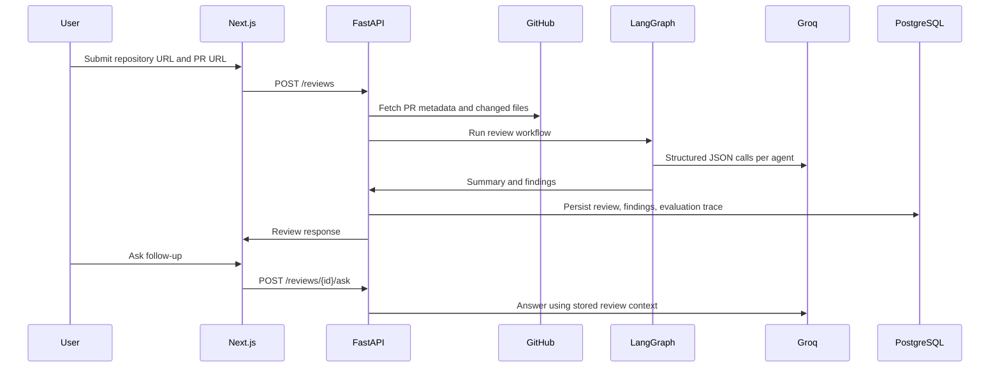

# AI Code Reviewer

Production-grade AI pull request review system built for AI Engineer, Applied AI Engineer, and LLM Engineer portfolios.

The app accepts a GitHub pull request URL, fetches changed files through GitHub APIs, runs a LangGraph multi-agent review workflow, stores structured findings in PostgreSQL, and supports conversational follow-up questions against the review context. Groq is the default provider, and Claude/Anthropic is supported through the same model abstraction.

## Architecture



## Sequence



## Local Setup

1. Copy environment files:

```bash
cp backend/.env.example backend/.env
cp frontend/.env.example frontend/.env.local
```

2. Start Postgres:

```bash
docker compose up postgres
```

3. Run backend:

```bash
cd backend
pip install -r requirements.txt
alembic upgrade head
uvicorn app.main:app --reload
```

4. Run frontend:

```bash
cd frontend
npm install
npm run dev
```

5. Open `http://localhost:3000`.

The backend has an offline deterministic mode when no provider key is set. Configure `GROQ_API_KEY` for Groq or set `LLM_PROVIDER=anthropic` with `ANTHROPIC_API_KEY` for Claude reviews.

Claude example:

```bash
LLM_PROVIDER=anthropic
ANTHROPIC_API_KEY=sk-ant-...
ANTHROPIC_MODEL=claude-sonnet-4-5
```

## API Documentation

FastAPI publishes interactive docs at `http://localhost:8000/docs`.

Key endpoints:

- `POST /api/v1/reviews`: create a PR review.
- `GET /api/v1/reviews/{review_id}`: fetch persisted review details.
- `POST /api/v1/reviews/{review_id}/ask`: ask follow-up questions using review context.
- `POST /api/v1/feedback`: persist thumbs up/down feedback.

## Deployment Guide

Frontend on Vercel:

- Project root: `frontend`
- Environment: `NEXT_PUBLIC_API_BASE_URL=https://<render-service>.onrender.com/api/v1`

Backend on Render:

- Project root: `backend`
- Build command: `pip install -r requirements.txt`
- Start command: `uvicorn app.main:app --host 0.0.0.0 --port $PORT`
- Environment: `DATABASE_URL`, `GROQ_API_KEY` or `ANTHROPIC_API_KEY`, `LLM_PROVIDER`, `GITHUB_TOKEN`, `CORS_ORIGINS`

Database on Supabase:

- Create a free PostgreSQL project.
- Use the pooled connection string as `DATABASE_URL`.
- Run `alembic upgrade head` from the backend environment.

## Interview Discussion Guide

Architecture decisions:

- Clean backend layering separates API routes, services, repositories, models, schemas, agents, prompts, and core infrastructure.
- The frontend stays operational and review-focused, with dashboard, details, history, settings, filters, agent traces, and follow-up chat.

LangGraph usage:

- The workflow runs PR analysis, security, performance, maintainability, and summary agents.
- Agent state carries PR context, intermediate outputs, and structured findings.

Prompt design:

- Prompts live in `backend/app/prompts`.
- Each agent has a role-specific prompt and returns a Pydantic-validated JSON schema.

Evaluation strategy:

- The backend stores prompt name, model, input, output, and human feedback.
- This supports regression checks, prompt iteration, and thumbs up/down quality tracking.

Scaling approach:

- Process large PRs by chunking changed files and running agent nodes concurrently.
- Add background jobs for long reviews and cache GitHub file payloads.
- Move rate limiting from in-memory middleware to Redis for multi-instance deployments.

Cost optimization:

- Use deterministic pre-filtering to skip generated or vendored files.
- Route simple follow-ups to smaller models when possible.
- Cache reviews per commit SHA and rerun only changed chunks.

Security considerations:

- API keys stay in environment variables.
- CORS is configurable.
- Inputs are validated with Pydantic.
- GitHub access uses optional token-based API calls.
- Findings explicitly check credential leakage, access control, injection, and logging risks.

## Repository Layout

```text
backend/app/api          FastAPI routes and dependencies
backend/app/agents       LangGraph workflow and prompt loading
backend/app/core         config, logging, database, rate limiting
backend/app/models       SQLAlchemy entities
backend/app/repositories database persistence
backend/app/schemas      Pydantic v2 contracts
backend/app/services     GitHub, review, and RAG services
frontend/app             Next.js app routes
frontend/components      UI components
```
