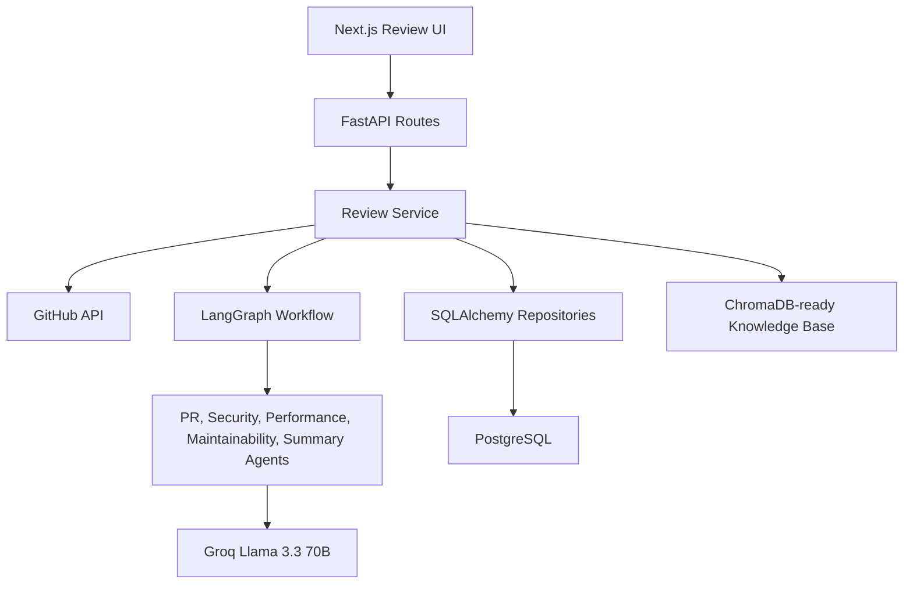

# Architecture

The system is a monorepo with a FastAPI backend, Next.js frontend, PostgreSQL persistence, and a LangGraph agent workflow.

Clean architecture boundaries keep transport, business logic, persistence, model calls, and prompts independently testable.
